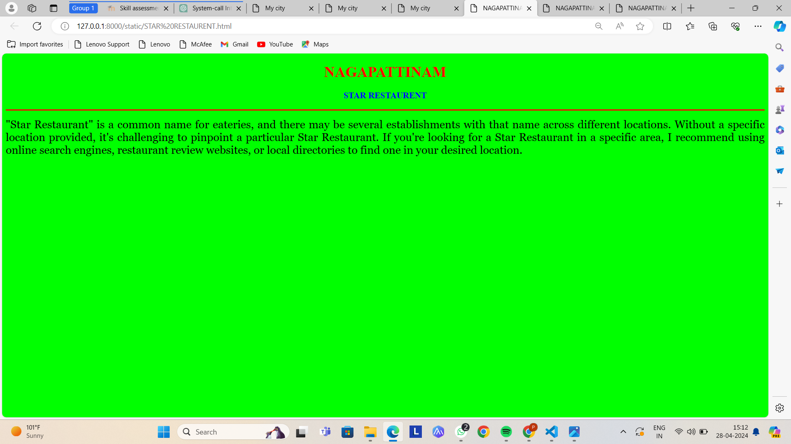
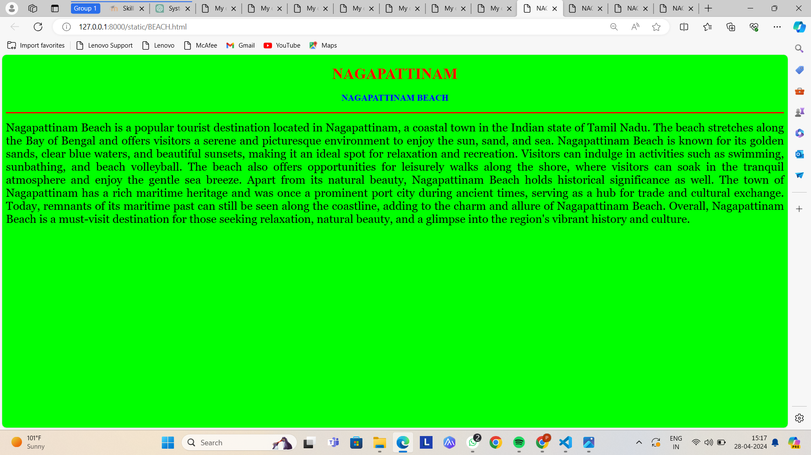

# Ex04 Places Around Me
## Date: 28/04/2024

## AIM
To develop a website to display details about the places around my house.

## DESIGN STEPS

### STEP 1
Create a Django admin interface.

### STEP 2
Download your city map from Google.

### STEP 3
Using ```<map>``` tag name the map.

### STEP 4
Create clickable regions in the image using ```<area>``` tag.

### STEP 5
Write HTML programs for all the regions identified.

### STEP 6
Execute the programs and publish them.

## CODE
### MAP
```HTML
<html>
<head>
<title>My city</title>
</head>
<body>
<h1 align="center">
<font color="blue"><b>NAGAPATTINAM</b></font>
</h1>
<h3 align="center">
<font color="black"><b>PRASANNA I (212223220079)</b></font>
</h3>
<centre>
<h4 align="center">
<map name="MyCity">
    

<map name="image-map">
    <area target="_blank" alt="nagapattinam" title="nagapattinam" href="nagapattinam.html" coords="690,89,872,149" shape="rect">
    <area target="_blank" alt="star restaurent" title="star restaurent" href="STAR RESTAURENT.html" coords="460,258,628,324" shape="rect">
    <area target="_blank" alt="arulmigu sri kayarohana swami temple" title="arulmigu sri kayarohana swami temple" href="temple.html" coords="418,128,654,198" shape="rect">
    <area target="_blank" alt="nagapattinam beach" title="nagapattinam beach" href="BEACH.html" coords="831,297,972,363" shape="rect">
    <area target="_blank" alt="devi cinemas" title="devi cinemas" href="DEVI CINEMAS.html" coords="559,0,476,33" shape="rect">
</map>
</h4>
</map>
</centre>
</body>
</html>
```
### NAGAPATTINAM HISTORY
```HTML
    <!DOCTYPE html>
<html lang="en">

<head>
    <title>NAGAPATTINAM</title>
</head>

<body bgcolor="lime">
    <h1 align="center">
        <font color="red"><b>NAGAPATTINAM</b></font>
    </h1>
    <h3 align="center">
        <font color="blue"><b>NAGAPATTINAM HISTORY</b></font>
    </h3>
    <hr size="3" color="red">
    <p align="justify">
        <font face="Georgia" size="5">
            "Nagapattinam" is a coastal town located in the Indian state of Tamil Nadu. It is situated on the Coromandel Coast of the Bay of Bengal and is known for its rich cultural heritage, historic temples, and scenic beaches. Nagapattinam has a significant maritime history and was a prominent port city during ancient times, serving as a major trade hub for merchants from various parts of the world. Today, it remains an important center for fishing and agriculture, as well as a destination for tourists interested in exploring its historical and religious landmarks.
        </font>
    </p>
</body>

</html>
```
### STAR RESTAURENT
```HTML
<!DOCTYPE html>
<html lang="en">

<head>
    <title>NAGAPATTINAM</title>
</head>

<body bgcolor="lime">
    <h1 align="center">
        <font color="red"><b>NAGAPATTINAM</b></font>
    </h1>
    <h3 align="center">
        <font color="blue"><b>STAR RESTAURENT</b></font>
    </h3>
    <hr size="3" color="red">
    <p align="justify">
        <font face="Georgia" size="5">
            "Star Restaurant" is a common name for eateries, and there may be several establishments with that name across different locations. Without a specific location provided, it's challenging to pinpoint a particular Star Restaurant. If you're looking for a Star Restaurant in a specific area, I recommend using online search engines, restaurant review websites, or local directories to find one in your desired location.
        </font>
    </p>
</body>

</html>
```
### TEMPLE
```HTML
<!DOCTYPE html>
<html lang="en">

<head>
    <title>NAGAPATTINAM</title>
</head>

<body bgcolor="lime">
    <h1 align="center">
        <font color="red"><b>NAGAPATTINAM</b></font>
    </h1>
    <h3 align="center">
        <font color="blue"><b>TEMPLE</b></font>
    </h3>
    <hr size="3" color="red">
    <p align="justify">
        <font face="Georgia" size="5">
            The Arulmigu Sri Kayarohana Swami Temple is a significant Hindu temple located in Nagapattinam, Tamil Nadu, India. It is dedicated to Lord Murugan, also known as Sri Kayarohana Swami or Kayarohanaswamy, who is considered the presiding deity of the temple.

This temple holds great religious and cultural importance for devotees, especially those who worship Lord Murugan. The deity is believed to possess divine powers and is revered for protection, prosperity, and blessings. The temple attracts devotees from various parts of Tamil Nadu and beyond, who visit to seek the blessings of Lord Murugan and offer prayers for their well-being and fulfillment of desires.

The temple features traditional Dravidian architecture, with intricately carved sculptures and colorful decorations adorning its premises. It typically holds regular rituals, prayers, and festivals dedicated to Lord Murugan throughout the year, which are attended by devotees in large numbers.

Overall, the Arulmigu Sri Kayarohana Swami Temple is an important religious site in Nagapattinam and a place of spiritual significance for followers of Hinduism, providing them with opportunities for worship, devotion, and spiritual fulfillment.


        </font>
    </p>
</body>

</html>
```
### BEACH
```HTML
<!DOCTYPE html>
<html lang="en">

<head>
    <title>NAGAPATTINAM</title>
</head>

<body bgcolor="lime">
    <h1 align="center">
        <font color="red"><b>NAGAPATTINAM</b></font>
    </h1>
    <h3 align="center">
        <font color="blue"><b>NAGAPATTINAM BEACH</b></font>
    </h3>
    <hr size="3" color="red">
    <p align="justify">
        <font face="Georgia" size="5">
            Nagapattinam Beach is a popular tourist destination located in Nagapattinam, a coastal town in the Indian state of Tamil Nadu. The beach stretches along the Bay of Bengal and offers visitors a serene and picturesque environment to enjoy the sun, sand, and sea.

Nagapattinam Beach is known for its golden sands, clear blue waters, and beautiful sunsets, making it an ideal spot for relaxation and recreation. Visitors can indulge in activities such as swimming, sunbathing, and beach volleyball. The beach also offers opportunities for leisurely walks along the shore, where visitors can soak in the tranquil atmosphere and enjoy the gentle sea breeze.

Apart from its natural beauty, Nagapattinam Beach holds historical significance as well. The town of Nagapattinam has a rich maritime heritage and was once a prominent port city during ancient times, serving as a hub for trade and cultural exchange. Today, remnants of its maritime past can still be seen along the coastline, adding to the charm and allure of Nagapattinam Beach.

Overall, Nagapattinam Beach is a must-visit destination for those seeking relaxation, natural beauty, and a glimpse into the region's vibrant history and culture.


        </font>
    </p>
</body>

</html>
```
### DEVI CINEMAS
```HTML
<!DOCTYPE html>
<html lang="en">

<head>
    <title>NAGAPATTINAM</title>
</head>

<body bgcolor="lime">
    <h1 align="center">
        <font color="red"><b>NAGAPATTINAM</b></font>
    </h1>
    <h3 align="center">
        <font color="blue"><b>DEVI CINEMAS</b></font>
    </h3>
    <hr size="3" color="red">
    <p align="justify">
        <font face="Georgia" size="5">
            As of my last update, I don't have specific information about a cinema named "Devi Cinemas" in Nagapattinam. However, it's possible that such a cinema exists but may not be widely recognized or may have been established after my last update. If you're looking for information about cinema theaters in Nagapattinam, I would recommend checking local directories, online listings, or contacting local residents for the most accurate and up-to-date information.
        </font>
    </p>
</body>

</html>
```


## OUTPUT
### MAP


### NAGAPPTINAM HISTORY


### STAR RESTAURENT


### TEMPLE


### BEACH


### DEVI CINEMAS
.png>)


## RESULT
The program for implementing image maps using HTML is executed successfully.
